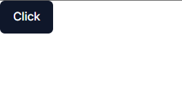

# About the Shadcn UI Components

Tags: `Shadcn-ui`, `Tailwind`, `TypeScript`


- Shadcn-ui 會提供組件使用，可以自由調配變換，並非存於 node_modules 的模組內，內部樣式由 Tailwind UI 配置樣式。
  https://ui.shadcn.com/docs

- 利用 cvs, tailwind-merge, class-variance-authority 掌握 tailwind 的 className 管理，製作類似 Material UI 那種 可重複式組件。
  https://www.youtube.com/watch?v=eXRlVpw1SIQ&t=1s

---



<font color="#ff8200">Home.tsx</font>

```javascript
import { Button } from '@/components/ui/button'

export default function Home() {
  return (
    <div>
      <Button> Click </Button>
    </div>
  )
}
```

<font color="#ff8200">utils.ts</font>

```javascript
import { type ClassValue, clsx } from 'clsx'
import { twMerge } from 'tailwind-merge'

export function cn(...inputs: ClassValue[]) {
  return twMerge(clsx(inputs))
}
```

<font color="#ff8200">Button.tsx</font>

```javascript
import * as React from 'react'
import { Slot } from '@radix-ui/react-slot'
import { cva, type VariantProps } from 'class-variance-authority'
import { cn } from '@/lib/utils'

const buttonVariants = cva(
  'inline-flex items-center justify-center rounded-md text-sm font-medium ring-offset-background transition-colors focus-visible:outline-none focus-visible:ring-2 focus-visible:ring-ring focus-visible:ring-offset-2 disabled:pointer-events-none disabled:opacity-50',
  {
    variants: {
      variant: {
        default: 'bg-primary text-primary-foreground hover:bg-primary/90',
        destructive:
          'bg-destructive text-destructive-foreground hover:bg-destructive/90',
        outline:
          'border border-input bg-background hover:bg-accent hover:text-accent-foreground',
        secondary:
          'bg-secondary text-secondary-foreground hover:bg-secondary/80',
        ghost: 'hover:bg-accent hover:text-accent-foreground',
        link: 'text-primary underline-offset-4 hover:underline',
      },
      size: {
        default: 'h-10 px-4 py-2',
        sm: 'h-9 rounded-md px-3',
        lg: 'h-11 rounded-md px-8',
        icon: 'h-10 w-10',
      },
    },
    defaultVariants: {
      variant: 'default',
      size: 'default',
    },
  }
)

export interface ButtonProps
  extends React.ButtonHTMLAttributes<HTMLButtonElement>,
    VariantProps<typeof buttonVariants> {
  asChild?: boolean
}

const Button = React.forwardRef<HTMLButtonElement, ButtonProps>(
  ({ className, variant, size, asChild = false, ...props }, ref) => {
    const Comp = asChild ? Slot : 'button'
    return (
      <Comp
        className={cn(buttonVariants({ variant, size, className }))}
        ref={ref}
        {...props}
      />
    )
  }
)
Button.displayName = 'Button'

export { Button, buttonVariants }

```
