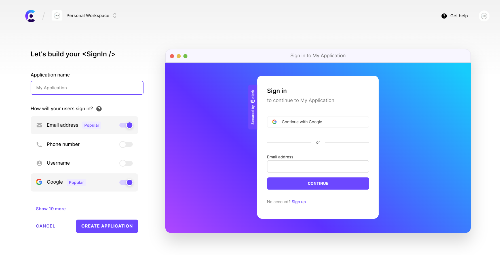
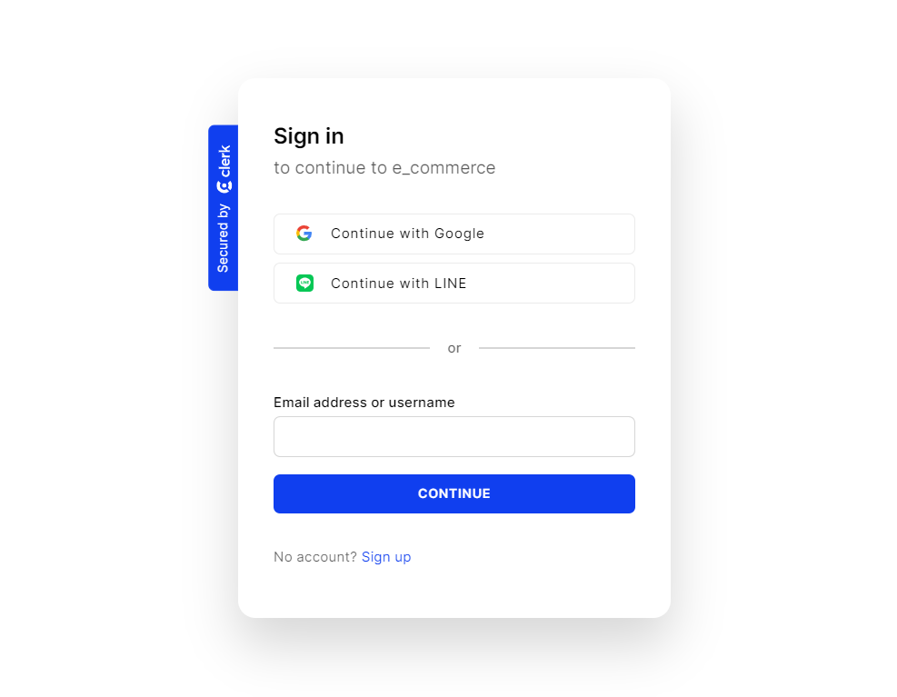

# Auth With Clerk

Tags: `Clerk`, `Next.js`, `TypeScript`

- Clerk Dashboard 建立目標內容。https://dashboard.clerk.com/
  

- 依 `Clerk` 步驟與路由規則建立驗證程序。https://clerk.com/docs/nextjs/get-started-with-nextjs
  - `Install`
  - `Env Keys setting`
  - `Protect your Application(middleware)`
    - 關於 `middleware` 的驗證內容 - https://clerk.com/docs/nextjs/middleware
  - `Mount the Provider`

---

`http://localhost:3000/sign-in?redirect_url=http%3A%2F%2Flocalhost%3A3000%2F`

Home.tsx
