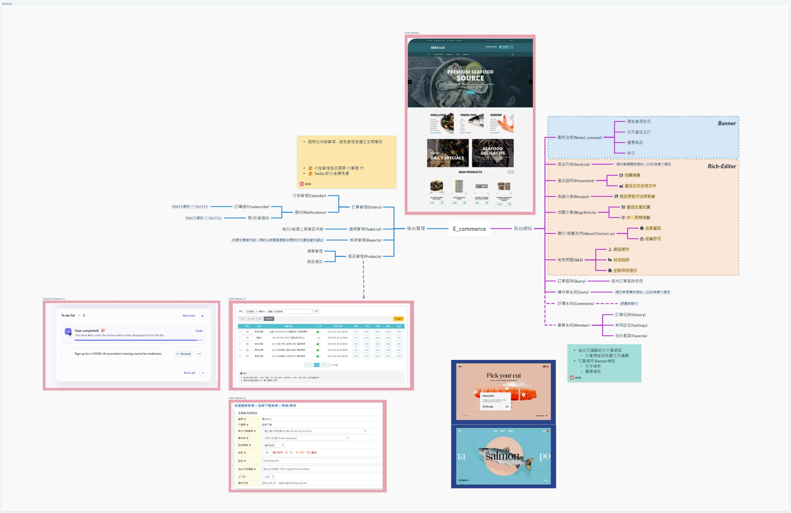
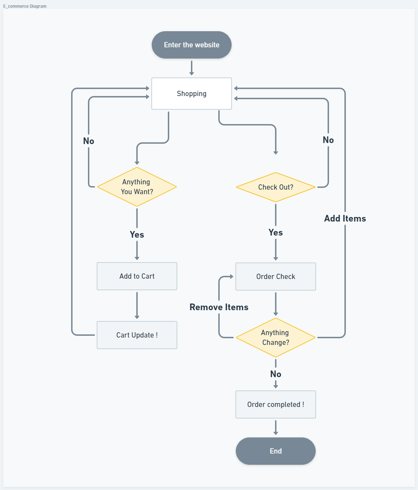

## E Commerce

---

> MindSet & Diagram: https://whimsical.com/e-commerce-MDjY2EtCpDLkeyXaRkwbbx

[Figma](https://www.figma.com/file/iNOVVwhCWzuzXlLcHdZD2v/E_commerce?type=design&node-id=0%3A1&mode=design&t=aP5KVNOiDwt6zrJk-1)

> Reference:

- [漁夫先生](https://www.mrfisherman.tw/%E6%B5%B7%E9%AE%AE%E5%A5%97%E7%B5%84B-seafood-Gift-box-b)
- [統一生機](https://www.organicshops.cc/)
- [湯瑪士肉舖](https://www.thomasmeat.com.tw/)

#### Main Skills & Framework:

Languages & Framework： `Next.js`, `TypeScript`
DataBase： `Prisma(serverless DB)`
State management： `Zustand`
Packages: `Email.js`
UI： `Tailwind UI/shadcn-ui`
🔥Deployment (yet)： `Vercel`
🔥Rich-Text: ` `
🔥Testing (yet)： `Test(Jest/React Testing Library)`

---

### >> :computer: 前台

`SEO: MetaData 給網站首頁`,
`SSR: 處理靜態文章部分`,
`CSR: 處理使用者互動部分 `

##### :bulb:首頁(MainPages) - `use server`

- Header
- Section
  - 最新消息(News) / Hero / Banner (Carousel)
    - 製作圖片上傳功能，裁切替換 banner/替換優惠
    -
  - 商品卡(Cards)
- Footer
  - 聯絡方式(Contacts Us)
  - 地點(Location)
  - 版權(CopyRights)

##### :bulb:最新消息(News) - `use server`

- 產品相關消息
- 產品主打
- 優惠商品
- 其它通知事項

##### :bulb:商品列表(ItemList) - `use client`

##### :bulb:食譜分享(Recipe) - `use server`

- 商品烹飪方法與教學

##### :bulb:(Blog/Article) - `use server`

- 產品生產紀實
- 其它文章、健康文章

##### :bulb:產品證明(Provements) - `use server`

- 相關標章
- 產品合格文件

##### :bulb:關於我們(About/Contact) - `use server`

- 店家資訊
- 經營許可

##### :bulb:常見問題(FAQ) - `use server`

- 網站操作
- 物流說明
- 生鮮保存指引

##### ❓ 訂單查詢(Query) - `use client`

##### ❓ 評價系統(Comments) - `use client`

##### ❓ 會員管理(Membership) - `use client`

- 訂單紀錄(History)
- 我的最愛(Favorite)
- 常用設定(Settings)

##### ❓ 購物車系統(ShoppingCart) - `use client`

- 側邊欄(offset carts)
- 訂單管理(OrderManagement)
- 會員訂購/ 非會員訂購 (member/none-member)

---

### >> :computer: 後台

##### :bulb:訂單管理

- 行程管理
- 通知
  - 訂購通知
  - 物流通知

##### :bulb:週期事項

- 每周/每日上線確認待辦事項

##### :bulb:報表管理

- `依需求擴增內容，預計以時間區隔配合開放式勾選做資料匯出`

##### :bulb:商品管理

- 清單管理
- 商品增刪改

---
