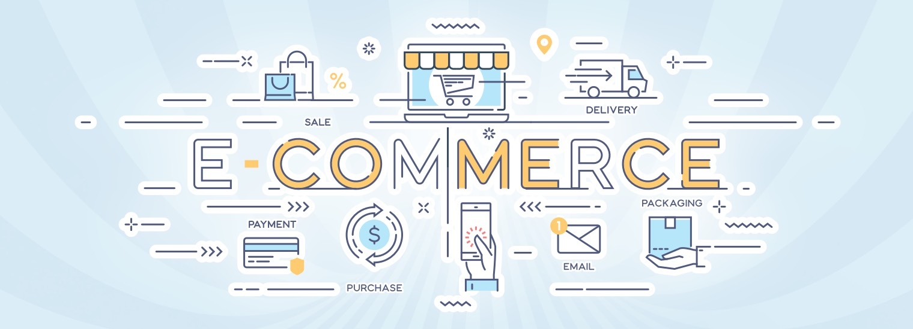

## E Commerce

---

`SEO`, `SSR`, `CSR`

#### Main Skills & Framework:

Languages & Framework： `Next.js`, `TypeScript`
DataBase： `Prisma(serverless DB)`
State management： `Zustand`

API：`React Query`
Packages: `Email.js`
Deployment (yet)： `Vercel`
🔥UI (yet)： `Bootstrap/Material UI/Tailwind UI`
🔥Rich-Text: ` `
🔥Testing (yet)： `Test(Jest/React Testing Library)`

---

### >> 前台

##### 首頁(MainPages) - `use server` (static)

- Header
  - Nav
- Section
  - 最新消息(News) / Hero / Banner (Carousel)
  - 商品卡(Cards)
- Footer
  - 聯絡方式(Contacts Us)
  - 地點(Location)
  - 版權(CopyRights)

##### 購物車系統(ShoppingCart) - `use client`

- 側邊欄(offset carts)
- 訂單管理(OrderManagement)
- 會員訂購/ 非會員訂購 (member/none-member)

##### 會員管理(Membership) (有與購物車系統重疊處 需要考量)

##### 最新消息(News) - `use server` (static)

##### 商品列表(ItemList) - `use client`

##### 食譜分享(Recipe) - `use server` (static)

##### 產品證明(Provements) - `use server` (static)

##### 關於我們(About) - `use server` (static)

##### 常見問題(Contact) - `use server` (static)

---

### >> 後台
