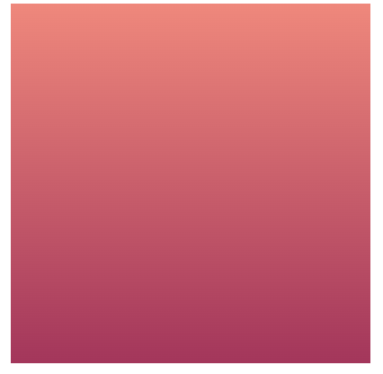

# DIY Card 規格

1. 主頁
   1. 左側欄位
      - 文字
        1. 字型 - google 免費字體
             - [M PLUS Rounded 1c - Regular 400](https://fonts.google.com/specimen/M+PLUS+Rounded+1c?preview.text=%E5%AD%97%E9%AB%94&preview.text_type=custom) 
               
                
            - [Noto Serif Tranditional - Light 300](https://fonts.google.com/noto/specimen/Noto+Serif+TC?preview.text=%E5%AD%97%E9%AB%94&preview.text_type=custom)
             
                
            - [Noto Sans Hong Kong - Regular 400](https://fonts.google.com/noto/specimen/Noto+Sans+HK?preview.text=%E5%AD%97%E9%AB%94&preview.text_type=custom)
            
                 
        2. 大小
           - select 選擇尺寸
             - 16px
             - 24px
             - 32px
           - 單位px 
        3. 粗體
           1. 預設 weight 400
           2. 加粗變 600
        4. 斜體
           1. 對focus的文字區塊，給class name對應css效果 - font-style: italic
        1. 一鍵全大寫
           1. 對focus的文字區塊，使用toUpperCase()做切換
           2. 切換大寫時候，原本的大小寫區分需保留暫存，再次切換時才可還原
        2. 顏色修改
           1. 對focus的文字區塊，使用 
          
          ```html
          <input type="color">
          ``` 
           選取顏色後，取得色碼，給予區塊id name ， css效果 - font-color : #xxx
      - 圖片
        1. 上傳圖片
           1. 上傳圖檔類型限制
              - png
              - jpg
           2. 上傳圖片預覽框 寬高：100 - 200 px 正方形
           3. 上傳做法 - 以下參考網站，實際實驗後挑選合適 或 各取其中需要的部分
              1. [參考1](https://codepen.io/l13013312333/pen/PEdbxe) 
              2. [參考2](https://ithelp.ithome.com.tw/m/articles/10269464)
              3. [參考3](https://ithelp.ithome.com.tw/articles/10270889)
        2. 尺寸設定
           1. 預先輸入尺寸
              1. input 框
                 1. 輸入限制 type="number"
              2. 單位 px
           2. 拖拉方式調整現有圖片尺寸，做法參考以下網站
              1. [參考1](https://juejin.cn/post/7117990537004580878)
              2. [參考2](https://cloud.tencent.com/developer/article/1938617)
        3. 圖片圓角設定
           1. input框輸入
              - type="number"
           2. 預設為0
           3. 單位 %
           4. 最多50 (圓形)
      - 背景 
        1. 純色
           1. 使用color picker 選定顏色
           
           ```html 
           <input type="color">
           ```
           2. 選定後，對背景區塊加上style 變更顏色
        2. 漸層
           1. 使用color pick 選定兩個顏色
              1. 第一個為起點顏色
              2. 第二個為終點顏色
              3. 對背景區塊，加上style 做顏色漸層
      
            ```css
           background-image: linear-gradient(to top, #b12a5b, #ff8177); 
            ```
            

           2. 調整漸層方向（上→下、下→上、左→右、右→左）
           3. 設立4個button，替換 css linear-gradient 第一個參數 
               - 上→下 : to top
               - 下→上 : to bottom
               - 左→右 : to left
               - 右→左 : to right
        3. 圖片做背景
           1. 實作方式，參照圖片上傳
           2. 直接對背景做背景圖片添加 
      - QRcode
        1. input 輸入網址
           - 驗證輸入需為 "https://" 開頭
        2. 功能實現方式 - 以下兩種擇一
           - [QRCode.js](http://code.ciaoca.com/javascript/qrcode/)
           - [vue-qrcode 套件](https://github.com/fengyuanchen/vue-qrcode)   
          > 此部分，若以上兩種都無法完成，考慮套用jquery方案 
        3. 新增按鈕 
      - 列印/下載
        1. 網頁列印
           1. 只列印出編輯區塊 
              - [參考做法](https://cyublog.com/articles/javascript-zh/zh-window-print/) 
        2. 下載
           1. PDF - 以下兩種擇一
              1. 套用列印裡的儲存PDF
              2. 指定區塊，使用html2Canvas+jsPDF
                 - [參考](https://juejin.cn/post/7001004981882519582)
           2. 圖片檔
              1. jpg
              2. png
              3. 指定區塊，轉成canvas下載
                 1. [參考1 - 可能無法指定檔案類型](https://blog.csdn.net/qq_45325810/article/details/125274204)
                 2. [參考2](https://blog.csdn.net/qq_45325810/article/details/125274204)
   2. 右側編輯區塊
      - header
        - 圖層調整（❌背景除外）
           - z-index 做圖層調整
           - 預設圖層
              - 圖片 1
              - 文字 2
              - QRCode 2
      - body
        1. 拖拽方式移動排版 
           1. [參考](https://codepen.io/DeyJordan/pen/oNaavJg)
        > - 已有使用 event 事件 mousemove、mouseup 實驗過，已可順利拖曳，但邊界判斷目前仍不太精準，需在克服
        > - 按照參考內容後續會再加上touchmove、touchend even事件

        2. 拖拉方式更改尺寸  
           - [參考1](https://juejin.cn/post/7117990537004580878)
           - [參考2](https://cloud.tencent.com/developer/article/1938617) 
       
